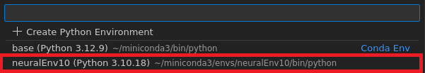

# ML-FPGA Deployment Workflow

This repository provides an educational reference implementation of the workflow presented in the workshop  **“From Algorithm to Hardware: Machine Learning in Embedded Systems”**, covering the end-to-end process from model design and compression to hardware-aware deployment.

This repository evolves across multiple editions of the workshop, incorporating feedback and improvements from different academic and professional training contexts.


## Course Instances
This framework has been used and iterated across multiple academic and professional training contexts. 
See `course_instances/` for contextual documentation of specific editions.


# Getting Started

## 1. Clone the Repository

First, clone the repository to your local machine:


```bash
# Clone the repository
git clone <repository-url>
cd <repository-name>

```

This will download all the project files, including the environment configuration needed for the next steps.

## 2. Environment Setup

This step creates and activates the *Conda* environment required for the projects. In the terminal, execute the following lines (the environment file is located at 00.environment/environment.yaml).

```bash
# Create the environment
conda env create -f environmentPython/environment.yaml
conda activate neuralEnv10
```


conda env create -f environmentPython/environment.yaml
The command `conda env create -f /environment.yaml` reads the `environment.yaml` file and installs all the specified dependencies into a new Conda environment called `neuralEnv10`.

Once the installation is complete, `conda activate neuralEnv10` activates the environment so that all subsequent commands run with the correct versions of Python and the required libraries.

After activating the environment, you are ready to proceed with the next steps.


### 2.1 Jupyter Notebook Environment

The notebooks in this project can be executed in any Jupyter-compatible environment (VS Code, Jupyter Notebook, JupyterLab, etc.).

>**Note**: Before starting, make sure the Conda environment `neuralEnv10` is correctly created and activated.

#### 2.1.1 Selecting the Kernel
Open the notebook `01-basicML.ipynb` located in the
**labs/lab01** folder.

Ensure that the notebook kernel is set to: `Python 3.10 (neuralEnv10)`

#### 2.1.2 Using Visual Studio Code (example)

If you are using **Visual Studio Code**:

1. Open the project folder in VS Code.
2. Open the notebook `01-basicML.ipynb` located in the **labs/lab01** folder.
3. Click **Select Kernel** (top-right corner).
4. Choose **Python Environments…** and select  
   **`neuralEnv10 (Python 3.10.18)`**.



> **Note:**  
> If you are using a different Jupyter interface, simply select `neuralEnv10`
> as the active kernel. The workflow and results will be the same.


#  General Workflow Guide
Throughout the course, students will follow a complete end-to-end workflow that transforms a trained neural network model into a hardware accelerator running on the AMD AUP-ZU3 platform. Although each case study focuses on a specific architecture (MLP, CNN, RNN), the overall process remains consistent. This section provides a high-level guide to the major stages and the corresponding Jupyter notebooks or tools used in each step.

## 1. Model Training

The workflow begins with training the neural network using the provided Jupyter notebooks.

This stage includes:

- Dataset loading and preprocessing.

- Model definition and training.

- Modle performance evaluation.

- Saving outputs in a standardized format (model.h5). 

These files serve as the inputs for later compression and hardware translation.

## 2. Model Compression

Next, optional compression techniques are applied to reduce the computational cost and memory footprint of the model:

- Quantization (lower-precision weights and activations).

- Pruning (removal of redundant parameters).

- Knowledge Distillation (training a compact student network).

The corresponding notebook demonstrates how each technique affects accuracy and hardware suitability.

## 3. Hardware Generation with hls4ml

The compressed (or uncompressed) model is then converted into synthesizable hardware using hls4ml.

This stage covers:

- Creating an hls4ml configuration from model.h5.

- Adjusting reuse factors and precision settings.

- Generating C++ project files compatible with Vitis HLS.

- Running C-synthesis, and exporting the IP core.

The notebook guides the process and produces an IP block ready for integration in Vivado.

## 4. Vivado Block Design

In this step, a reusable block design is created, that integrates:

- The hls4ml-generated IP core.

- AXI DMA for data movement.

- Clocking and reset infrastructure.

- Connections to the Zynq processing system.

Only the accelerator IP changes between case studies; the rest of the design remains common.

A reference Vivado project and build script are provided to streamline this process.

## 5. Deployment and Execution

After hardware generation, the design is deployed onto the target platform for execution and validation.

This stage includes:

- Hardware configuration and programming,

- Interface initialization,

- Data transfer setup,

- Execution of inference workloads,

- Collection of performance and functional metrics.

To simplify this process, deployment templates are provided, offering a standardized structure for hardware initialization, data movement, and inference execution.
These templates ensure reproducibility and reduce the effort required to deploy models across different platforms and experiments.


# Presentations

**Link:** https://dbox.ictp.it/s/ySDsRzqdZLz2ntw
