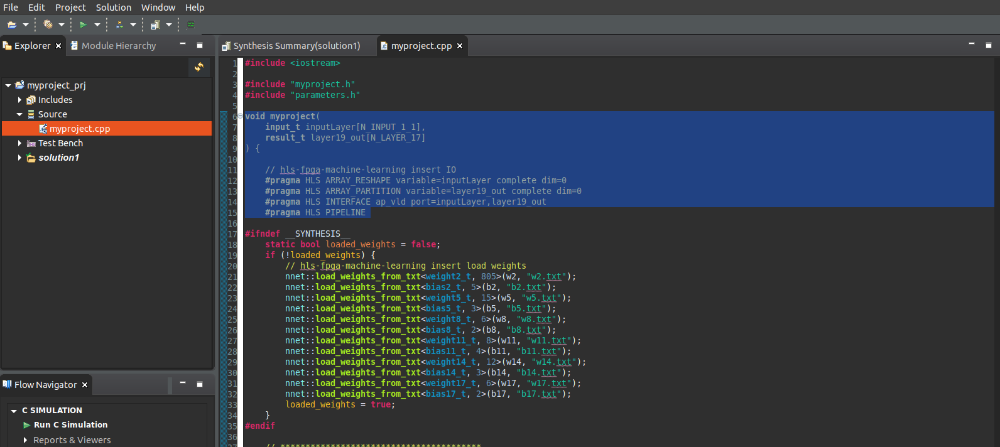
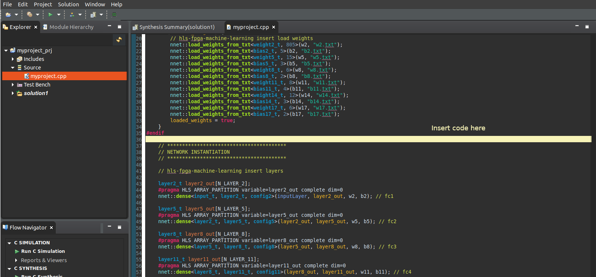
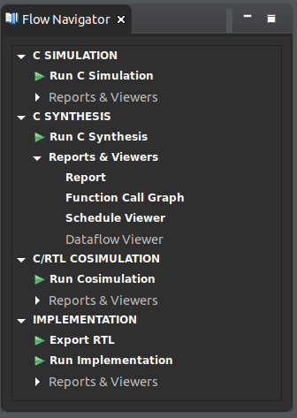
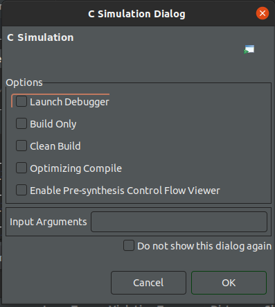
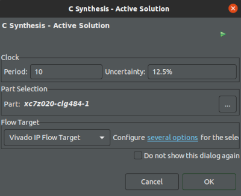
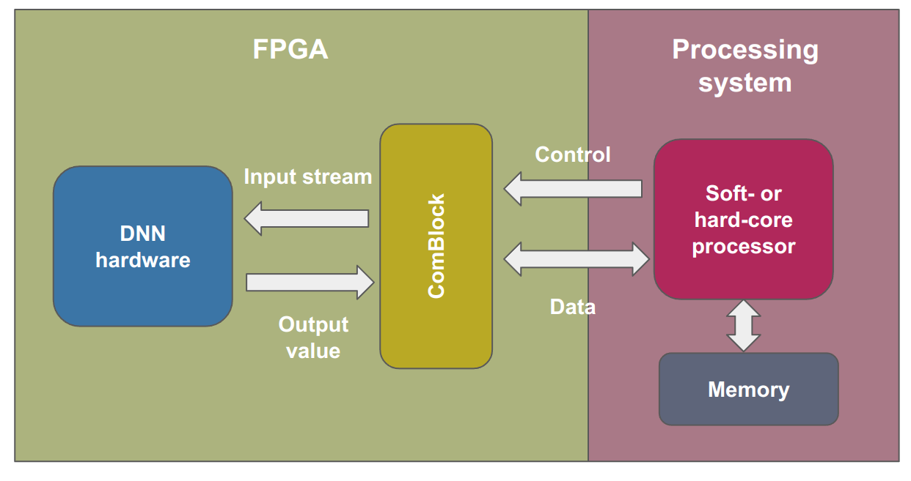
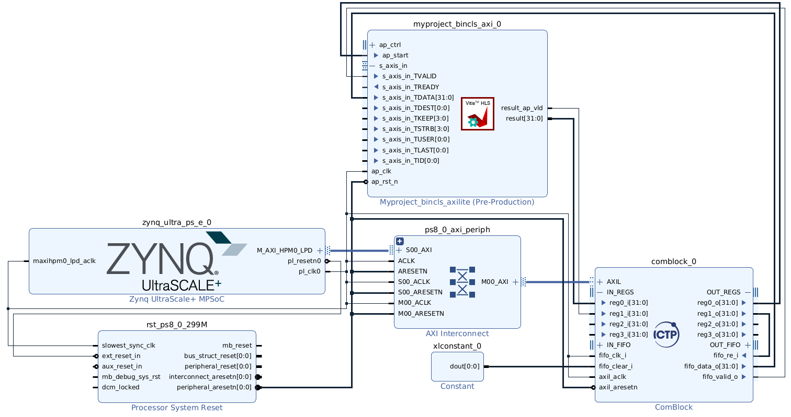

# End-to-End Workflow for Deploying Machine Learning Models on SoC-FPGA

## 1. Outline

### 1.1. Introduction

In this laboratory, the focus will be on employing an **end-to-end workflow** for mapping deep neural networks (DNNs) to an SoC/FPGA platform, as presented by *Molina et al.* [1]. The primary steps of this workflow are illustrated in the figure below. The process begins with the dataset used to train and compress the target model. From this, a data structure is generated that contains information about the model’s layers, weights, and biases. This data structure is then processed by a hardware synthesis tool for machine learning, which translates the DNN model into hardware. Finally, inference hardware is created and integrated into an evaluation template to verify its functionality on the SoC/FPGA device.

To implement this methodology, we make use of **hls4ml** (High-Level Synthesis for Machine Learning), which converts machine learning models into hardware descriptions compatible with Xilinx’s **Vitis HLS** tools. This stage serves as a bridge between the software-generated neural network and the FPGA hardware implementation.  

For the hardware assessment framework, the design integrates the **ComBlock module**, which provides configurable communication interfaces, and **UDMA**, which enables efficient data transfer from the host PC. Together, these components allow verification and validation of the inference functionality directly on the hardware platform.  

### 1.2. Laboratory Workflow

In this part of the lab, we will first build the **compressed student model** using techniques such as **pruning, quantization, and knowledge distillation**. Once the compressed model is obtained, we will employ **hls4ml** to generate the IP core to be integrated into the final hardware design. Within this workflow, **hls4ml** acts as the bridge between the compressed neural network and the **HLS tool**.  

After generating the IP core, we will use the **HLS tool** to configure the interfaces of the top function and to create a testbench for functional verification. Once the IP has been successfully validated, the next step will be to proceed with the **block design in Vivado**, where all hardware components involved in the process will be integrated. This integration enables deployment of the inference stage on the FPGA platform.  

Finally, the **hardware-implemented inference stage** will be validated using **UDMA** to ensure both correctness and performance.  

### 1.3. Objectives

* Learn how to compress an ML-based model for resource-constrained devices.  
* Understand how **hls4ml** can be used to translate the model into an HLS project.  
* Explore the different configuration options provided by **hls4ml**.  
* Learn how to deploy ML-based models on SoC-FPGA platforms. 
* Perform the instantiation of an IP core previously designed through High-level Synthesis tool.
* Integrate and verify the complete hardware design.

# Part A.

## 2. Compression 

In this part of the lab, we will first build the **compressed student model** using techniques such as pruning (P), quantization (Q), and knowledge distillation (KD). Once the compressed model is ready, we will employ **hls4ml** to generate the IP core that can be integrated into the final hardware design. 

In the upcoming steps, we will focus on model compression. This section also serves as a recap of the previous content.

### 2.1. Teacher model

In order to use KD as compression technique, a teacher architecture should be generated. In this project, it is defined as a multi-layer perceptron (MLP) composed of six layer.

The mains steps to perform in this stage are:

1. Load the dataset.  
2. Print some trace to observe the signals. 
3. Split the dataset into training, validation, and testing.
5. Train the teacher model. 
6. Plot the confusion matrix to observe the model behavior for the two classes. In this step, the **testing dataset** should be used. 
7. Save the trained model.

### 2.2 Student model

Since the model to be deployed into the SoC/FPGA should be compressed, a student architecture is defined through quantization and pruning strategies in order to apply quantization-aware pruning (QAP) in the learning process through KD.

The model is a MLP-based composed of six layers. 
Quantization is performed using 8-bit fixed-point precision and pruning with a target sparsity of 50%. 

The teacher generated in the previous step is employed in the distillation process. In this manner, the final student can mimic the teacher's behavior. 

1. Define the student architecture. 
2. Train the student model.
3. Plot the confusion matrix to observe the model behavior for the two classes. In this step, the testing dataset should be used. 
4. Perform single predictions.
5. Save the trained model, that will be use in the next step. 

## 3. hls4ml integration

The main objective of this stage is to generate the IP core for the inference stage of the gamma/neutron discriminator. The general steps are as follows: 

1. Add the path to Vitis HLS tool. 
2. Load the pre-trained student model. 
3. Define the configurations for **hls4ml** library.
4. Convert the Keras model to HLS project. 
5. Compile and build the HLS project. 


## 4. Jupyter Notebook Environment

1. Go to the **mylabs** folder.

2. Rigth click on the **Lab5_ML** folder and click on **Open with "Visual Studio Code"**.

3. Open the **`03-compression_hls4ml.ipynb`** file that you can find inside the folder `Lab5_ML/partA/`. Select the **neuralEnv10 (Python 3.10.18)** kernel.

4. **Complete all the steps in the Jupyter Notebook. After finalizing your code, this section of the lab will be complete. Return here afterward to proceed with the subsequent steps of the lab.**

# Part B.

## 5. HLS simulation, synthesis, and implementation

The verification of the IP's functionality is performed using the Vitis HLS tool. To achieve this, several changes must be made to the generated **.cpp source** files to add the interfaces and test the IP core. Therefore, the following steps should be performed:

1. Open Vitis HLS. 

2. Select the Open Project option. Select the folder **partA/hlsPrj/myproject_prj**, which was generated in the Jupyter notebook. In this way, the project created with **hls4ml** will be loaded into the Vitis HLS. 

3. Perform the following configurations in the project:
    
    - In the menu, go to **Project -> Project Settings**. Click on **Synthesis**. 
    - In the _Synthesis settings_, change the name of the **top function** by **GN_inference**. 
    
      >**Note**: The **top function** acts as the entry point for the Vitis HLS design, linking all input and output ports of the hardware module. It is responsible for setting up the required input values and triggering the hardware module. Once the computation is complete, the **top function** gathers the output values and returns them to the software application.

4. Check the following configurations related to the solution. 

    -   In the menu, go to **Solution -> Solution Settings**. Click on **Synthesis**. 
    - Set the **Clock** in **10**, with an **uncertainty** value of **12.5%**. 
    - Select the corresponding part: **xczu4eg-sfvc784-2-e** or **xczu3eg-sfvc784-1-e**
    - Leave the Flow Target as **Vivado IP Flow Target**. 
    - Click **OK**. 


🔴 In this step, **several parts of the code need to be added or replaced**. 

5. In this step, several parts of the file **myproject.cpp** inside Vitis HLS will be replaced. **The images below will help you to identify the different parts of the code and the place where they should be added.** 

    To create an HLS project using **hls4ml** with specific interface directives, especially when dealing with AXI stream interfaces, it is necessary to modify the top-level function and specify the interface pragmas for the input and output ports accordingly. This requires using a specific structure for streaming data depending on the HLS tool (in Vitis HLS, _hls::stream_ is used).
    
    In this project, only the input port will use an _AXI stream_ interface, while the output port will utilize the _ap_vld_ interface. For the control ports, the _ap_ctrl_hs_ protocol is implemented. Copy the following code 

    ```c
    void GN_inference(

        hls::stream<AXI_VALUE_IN> &input,
        int *result

    ) {      
        #pragma HLS INTERFACE mode=ap_ctrl_hs port=return
        #pragma HLS INTERFACE axis register both port=input
        #pragma HLS INTERFACE ap_vld port=result
        #pragma HLS PIPELINE

    ```
    
    replacing the selected parts in the file **myproject.cpp**.

    

6. To replace the default test bench file with the one created for this workshop, go to the folder **/home/student/workshop/mylabs/Lab5_ML/partB/hls_src** and copy the file **myproject_test.cpp**. pase it on the folder **/home/student/workshop/mylabs/Lab5_ML/partA/hlsPrj/**, select the option **Replace**.

7. You also need to update the header file, go to the folder **/home/student/workshop/mylabs/Lab5_ML/partB/hls_src** and copy the file **myproject.h**. pase it on the folder **/home/student/workshop/mylabs/Lab5_ML/partA/hlsPrj/firmware/**, select the option **Replace**.

8. Open the file **myproject.cpp**. 


    🔴 Then, the following code should be added in the file **myproject.cpp**. This change allows unpack the input stream in a vector to be used by the algorithm. 

    ```c
    AXI_VALUE_IN valIn;

    input_t inputLayer[N_INPUT_1_1];
    result_t layer19_out[N_LAYER_17];

    #pragma HLS ARRAY_RESHAPE variable=inputLayer complete dim=0
    #pragma HLS ARRAY_PARTITION variable=layer19_out complete dim=0

    for(int h=0; h<N_INPUT_1_1; h++){
    #pragma HLS PIPELINE
        // Read and cache value
        valIn = input.read();
        inputLayer[h] = valIn.data;
    }	
    ```
    The previous code should be placed after the line **#endif** (line number 36) in the file **myproject.cpp**.

    

    <!--  -->

    🔴 The following code allows to output the discrimination results. 

   ```c
    int tmpVal = 0;
    if(layer19_out[0] > 0.5){
        // Value 0 corresponds to class 0 gamma
        tmpVal = 0;
        *result = tmpVal;
    }
    else {
        // Value 1 corresponds to class 1 neutron
        tmpVal = 1;
        *result = tmpVal;

    }
    ```
    Add the previous code before the last **\}** in  **myproject.cpp** file. Use the following image as reference. 

    


After completing the code modifications, the next step is to analyze the behavior of the IP core when gamma or neutron signals are applied as inputs.

9. Go to the flow navigator pane (left bottom corner).  Under **C SIMULATION**, click on **Run C Simulation**. 


    


10. A _C Simulation Dialog_ will appear. Click **OK**. The simulation will start. Wait for the results. 

    

11. After the simulation, in the Flow Navigator pane, under **C SYNTHESIS**, click on **Run C Synthesis**. A pop-up window will appear with configurations for the active solution, displaying the values for the clock, FPGA part, and flow target. Leave these settings as they are and click the **OK** button. Wait for the synthesis report. 

    


12. The final step is generate the IP core. In the flow navigator pane (left bottom corner), under **IMPLEMENTATION**, click on **Export RTL**. In the **Display Name** option, add the name **GN_inference**. Click the **OK** button. Wait until the export process is completed. 

    ../img/lab_gammaNeutron/part2/popUp_impl.png)


With the generated IP core, it is time to test the inference process in the SoC platform. 

## 6. Hardware

The hardware assessment framework is based on the following Figure. 

{width=60%}


### 6.1. Vivado Project

1. Open _Vivado 2022.2_.

2.  From the **Quick Start** menu, click  to start the wizard or click **File → Project → New**. You will see **Create A New Vivado Project** dialog box in the **New Project** window. Click **Next**. Use the information in the table below to configure the different wizard options:

| Wizard Option | System Property | Settings |
|---------------|-----------------|----------|
| Project Name | Project Name | Lab5 |
|  | Project location | `lab_gammaNeutron/` |
|  | Create Project Subdirectory | Check this option. |
| Click **Next** |  |  |  
| Project Type | Project Type | Select **RTL Project**. Keep  unchecked the option `do not specify sources at this time`.  | 
| Click **Next** |  |  | 
| Add Sources | Do nothing |  |  
| Click **Next** |  |  |  
| Add Constraints | Do Nothing |  |  
| Click **Next** |  |  |  
| Default Part | Specify | Select **Boards** |  
|  | Board | Select **Assigned HyperFPGA board** |  
| Click **Next** |  |  |  
| New Project Summary | Project Summary | Review the project summary |  
| Click **Finish** |  |  | 

### 6.2. IP repository

#### 6.2.1. Add the IP cores repository

In this section you'll import the external IP core into the project: **HLS-based ML inference**.

1. Click **Settings** in the Flow Navigator. Expand the **IP** option on the left pane of the Project Settings form.

2. Click on **Repository**, then click on the **Add** icon.

3. Browse to `labs/lab_gammaNeutron/partA/hlsPrj/myproject_prj/solution1/impl` directory, select it, and finally click on the **Select** button. This directory contains the IP core exported from the HLS project.


4. The **GN_inference IP** core should appear under **IPs** in the **Add Repository** window.

5. Clone the ComBlock repository from https://gitlab.com/ictp-mlab/core-comblock.


6. Add the ComBlock repository. 


### 6.3. Block Design

We will make use of the Tool Command Language (**TCL**) to build a Block-level design from the provided source files and a TCL script. You'll notice how Vivado will start building the system from scratch until resulting into a synthesizable design. This is a clean way to work with version control tools (such as Git) in collaborative environments.

1. This project uses a pre-generated block design (BD). To re-generate it, in the Vivado lower pane, click the **Tcl Console** tab.

2. To find out which directory you are working on, type in the TCL command line `pwd`. This will print out the current working directory.


``` bash
pwd
```

3. Move your working directory to the **bd** directory. Hence, use the `tcl` command **cd** to change the directory. Type:

``` bash
cd labs/lab_gammaNeutron/partB/bd/
```

>Note: The path may be different based on your configuration and file locations.

4. A TCL file can be sourced from Vivado. To recreate the block design you will need a `tcl` command file, that in this case is **bd_gn_inference.tcl**. To recreate the block design, type in the Tcl console:

**For The HyperFPGA 3be11:**

``` bash
source ./gn_3be11.tcl
```

**For The HyperFPGA 4eg21:**
``` bash
source ./gn_4eg21.tcl
```


>**Note:** When you trigger the execution of a Tcl script in the Vivado, a progress bar appears, and all operations within Vivado are halted until the script ends running.

As result of the process, you will get a block design with these main components: Zynq7 Processing system, ComBlock, HLS-based inference. 

5. **Regenerate Layout** and take a closer look at the design, the connections, and the configuration registers. The final block design should look as follows:



6. **Generate output products** of the block design.

7. **Create HDL wrapper** of the block design and set it as **Top**. 

8. In the **Flow Navigator** pane click on **Generate Bitstream** and click **Yes** if prompted to save the **Block Diagram**. Also, click **Yes** when prompted to launch synthesis and implementation. Click **Cancel** when prompted to Open the **Implemented Design**.

9. Since you need to create an application to use your design, you have to export the generated hardware to the Vitis environment. Click on: **File -> Export -> Export Hardware**. Since there is some logic in the PL part of the Zynq, the respective bitstream has to be included in the export task. Hence, be sure to check the **Include bitstream** box. Then click **Next**.

10. In the following window, change the _XSA file name_ to **ML_3be_11-v2-3be11.xsa** or **ML_4eg_21-KalEdge-4ge21.xsa**, based on your assgined board in the cluster. Click **Next**, and then **Finish**.

At this point your hardware design and configuration are set and you can proceed to generate an application project in Vitis. 

## 10. Interaction with the HyperFPGA

1. Access to the HyperFPGA: https://hyperfpga.sti.ictp.it/.
2. In the workspace area, upload the **`.xsa` file** located in: `scripts/prj`. 
3. Upload the **testing dataset** located at:
 `ml-fpga-deployment-workflow/labs/labKalEdge-Integration/src`.
4. Finally, upload the corresponding **Jupyter Notebook** found in: `ml-fpga-deployment-workflow/labs/labKalEdge-Integration/src`.

>Note: These files are required to run the validation and deployment steps on the FPGA platform.


### Required Files for Deployment

| Item | Path | Purpose |
|------|------|---------|
| `.xsa` file | `scripts/prj` | Contains the synthesized hardware design exported from Vivado. |
| Test dataset | `ml-fpga-deployment-workflow/labs/labKalEdge-Integration/src` | Used for validating the deployed model on FPGA. |
| Jupyter Notebook | `ml-fpga-deployment-workflow/labs/labKalEdge-Integration/src` | Executes inference and evaluates performance metrics. |


> Note:
> If you are unable to generate the `.xsa` file locally (for example, due to the absence of Vivado), a pre-generated version is provided.
>  
> The file can be found in:
>
> ```
> ml-fpga-deployment-workflow/labs/labKalEdge-Integration
> ```
>
> This allows you to continue with the laboratory without running the HLS or Vivado flow.


5. Continue with the lab in the HyperPFGA.

## 11. Challenge (Optional)

- Stage 1
    - For the student model, implement the following configurations:
        - 16-bit fixed-point precision (16,6) and a target sparsity of 60%.
        - 4-bit fixed-point precision (4,2) and a target sparsity of 60%.
        - 8-bit fixed point (8,4) and different values for the sparsity: 20%, 30%, 70%, 80%.
        - Compare the solutions considering the confusion matrix and the training curves (accuracy and loss). 

    Keep in mind that it is probably that you should modify the hyperparameters (learning rate, batch, epochs, and optimizer).

- Stage 2
    - Synthesize the ML-based IP core for the following cases and compare the synthesis reports obtained: 
        - 16-bit fixed-point precision (16,6) and a target sparsity of 60%.
        - 4-bit fixed-point precision (4,2) and a target sparsity of 60%.
    
    - What conclusions could be obtained?

- Stage 3 
    - Repeat the hardware implementation process for the following case: 
        - 4-bit fixed-point precision (4,2) and a target sparsity of 60%.


## References

[1] Molina, R. S., Morales, I. R., Crespo, M. L., Costa, V. G., Carrato, S., & Ramponi, G. (2024). An End-to-End Workflow to Efficiently Compress and Deploy DNN Classifiers On SoC/FPGA. IEEE Embedded Systems Letters, 16(3), 255-258. 

[2] Morales, I. R., Crespo, M. L., Bogovac, M., Cicuttin, A., Kanaki, K., & Carrato, S. (2024). Gamma/neutron classification with SiPM CLYC detectors using frequency-domain analysis for embedded real-time applications. Nuclear Engineering and Technology, 56(2), 745-752.

[3] Zhou, W., Cui, T., Zhang, Z., Yang, Y., Yi, H., & Hou, D. (2023). Measurement of wide energy range neutrons with a CLYC (Ce) scintillator. Journal of Instrumentation, 18(02), P02014.

--

Prepared by ICTP-MLAB.

---


