# Hello World from Zynq

### 1.1. Introduction

This laboratory will guide you through creating the classic **Hello World** application for an FPGA-based **System-on-Chip (SoC)**.

### 1.2. Objectives

- Gain familiarity with the SoC-FPGA design flow using the unified **Vitis** software platform.
- Create the hardware to configure the FPGA fabric (PL) and configure the Processing System (PS).
- Create the **C** application (in Vitis) that will run on the PS.
- Test the complete design on the **ZedBoard** (or **PYNQ**) to verify correct operation (Vitis + serial port).

---

## 2. Hardware

### 2.1. Vivado Project

1. Open **Vivado 2022.2**.

2. From the **Quick Start** menu, click  to start the wizard, or click **File → Project → New**.  
   You will see the **Create A New Vivado Project** dialog in the **New Project** window. Click **Next**.  
   Use the information in the following table to configure the wizard options:

| Option | System Property | Configuration |
|---------------|-----------------|----------|
| Project Name | Project Name | Lab03 |
|  | Project Location | `/home/student/Documents/cursoML/labs` |
|  | Create Project Subdirectory | Check this option. |
| click **Next** |  |  |
| Project Type | Project Type | Select **RTL Project**. Keep the option `do not specify sources at this time` **unchecked**. |
| click **Next** |  |  |
| Add Sources | Do nothing |  |
| click **Next** |  |  |
| Add Constraints | Do nothing |  |
| click **Next** |  |  |
| Default Part | Specify | Select **Boards** |
|  | Board | Select **ZedBoard Zynq Evaluation and Development Kit** |
| click **Next** |  |  |
| New Project Summary | Project Summary | Review the project summary |
| click **Finish** |  |  |

After clicking **Finish**, the **New Project Wizard** closes and the created project opens in the main Vivado interface, which is divided into two main sections: **Flow Navigator** and **Project Manager**.  
In the Project Manager area, you can see the **Project Summary**, which includes configuration details, the selected board part, and synthesis information.  
For more details, click [here](https://china.xilinx.com/support/documents/sw_manuals/xilinx2022_2/ug892-vivado-design-flows-overview.pdf).

By selecting the **ZedBoard** platform, the **IP Integrator** becomes board-aware and will automatically assign PS I/O ports to physical pin locations mapped to the board peripherals when using the **Run Connection** wizard. In addition to pin constraints, **IP Integrator** also defines the I/O standard (LVCMOS 3.3, LVCMOS 2.5, etc.) for each I/O pin, saving time during the design process.

---

### 2.2. Block Design

In this section, we will use the **IP Integrator** to create an embedded processor design.

#### 2.2.1. Creating the Block Design

1. Click **Create Block Design** in the **Flow Navigator** panel under **IP Integrator**.

2. In the **Create Block Design** pop-up window, set the **Design Name** to *bd_helloWorld* and keep the remaining options as default.

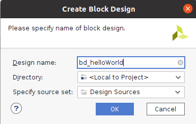

In the main interface, a new blank diagram canvas will appear in the **Block Design** section. This canvas will be used to create the hardware design that will be implemented on the Zynq device.

#### 2.2.2. Instantiation and Configuration of the Processing System (PS)

For this laboratory, we will enable the **AXI_M_GP0** interface and the **FCLK_RESET0_N** and **FCLK_CLK0** ports.

1. The first step is to add the ZYNQ7 Processing System (PS) block. You can do this by clicking the  icon in the diagram toolbar, or by right-clicking on the blank canvas area and selecting **Add IP**.

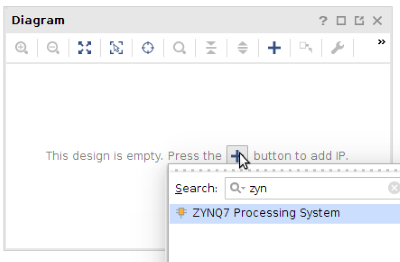

A small window will appear showing the available IPs. To locate the PS7 IP core, scroll to the bottom of the list or search using the keyword *zynq*. Double-click **ZYNQ7 Processing System** to add it to the canvas.

After that, the **Zynq7 PS IP** block is placed on the canvas. The I/O ports shown on the Zynq block are defined by the default configuration for this block.

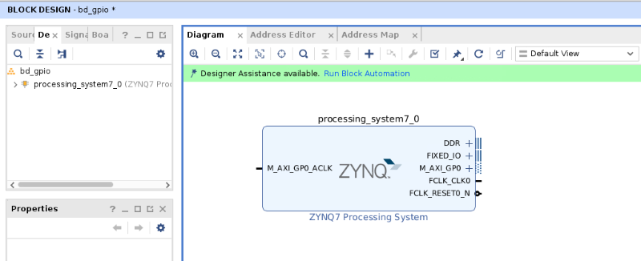

2. Click **Run Block Automation**, available in the green information bar.

3. In the **Run Block Automation** window, select **/processing_system7_0**. Make sure **Apply Board Presets** is **selected**, and keep the rest of the options as default. Click **OK**.

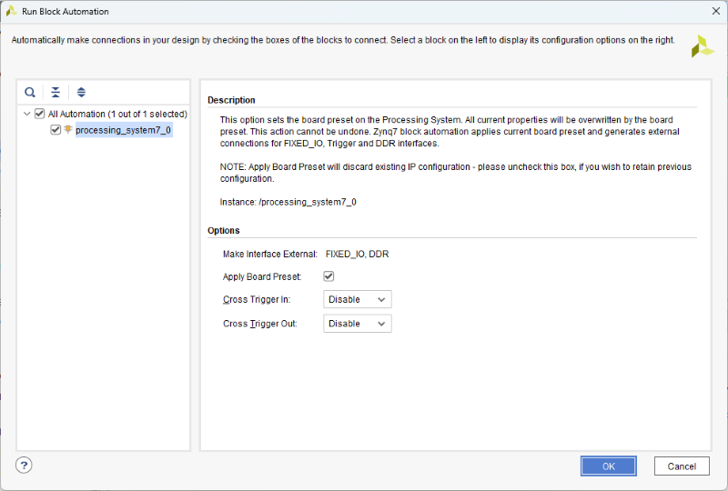

After completing the previous step, the block diagram should look like this:

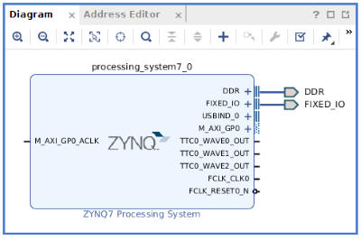

4. Double-click the **Zynq7 PS** block to open the **Re-customize IP** window. **All required processor configurations are done here.**

The **Zynq block design** illustration should now be open, showing the configurable blocks of the Processing System (green blocks are configurable).

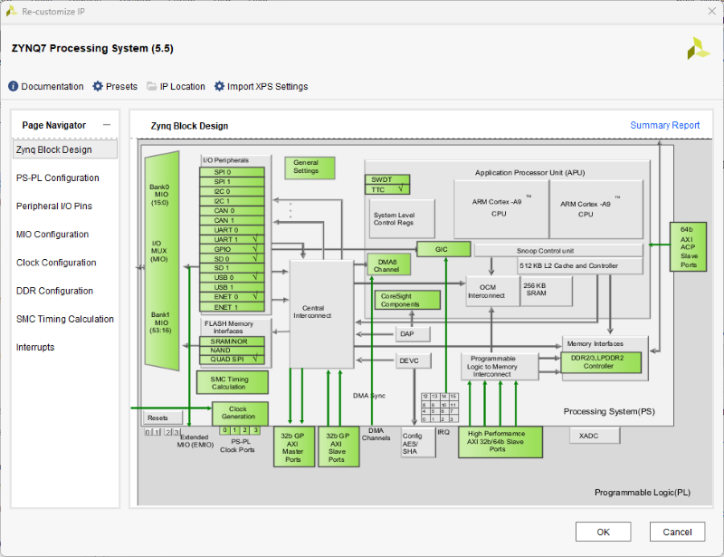

5. Click **PS-PL Configuration** in the Page Navigator panel. Expand **General** and verify that the UART1 baud rate is set to **115200**.

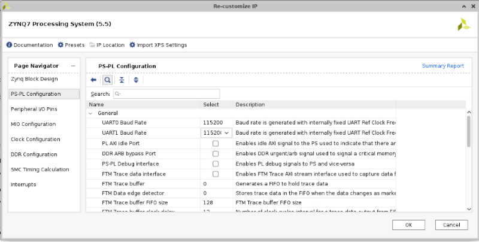

6. Go to **Peripherals I/O Pins** and verify that the Zynq I/O pins are associated with UART1.

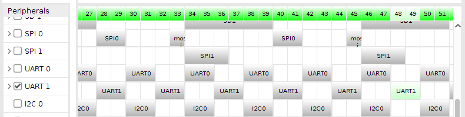

7. Click **MIO Configuration** in the Page Navigator panel. Expand **I/O Peripherals** and uncheck all peripherals except **UART1**. The **PS UART1** will be used to communicate the Zynq device with the PC. *This communication will be done using a serial terminal such as GTKTerm.*

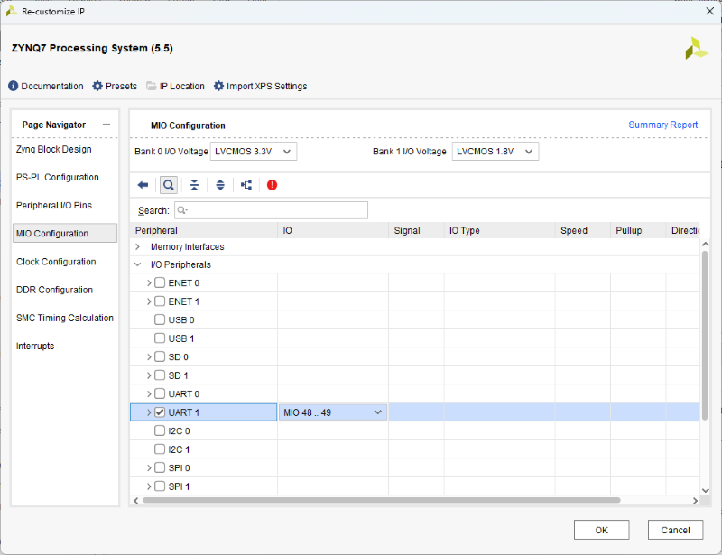

8. Expand **Application Processor Unit** and uncheck **Timer 0**. We are not using it in this laboratory.

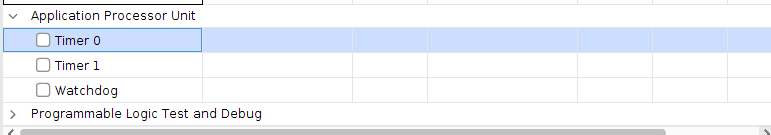

9. Click **Clock Configuration** and expand **PL Fabric Clocks**. Verify that **FCLK_CLK0** is enabled and its frequency is set to **100 MHz**.  
   **This section defines the clock frequency for the PL (Programmable Logic) design.**

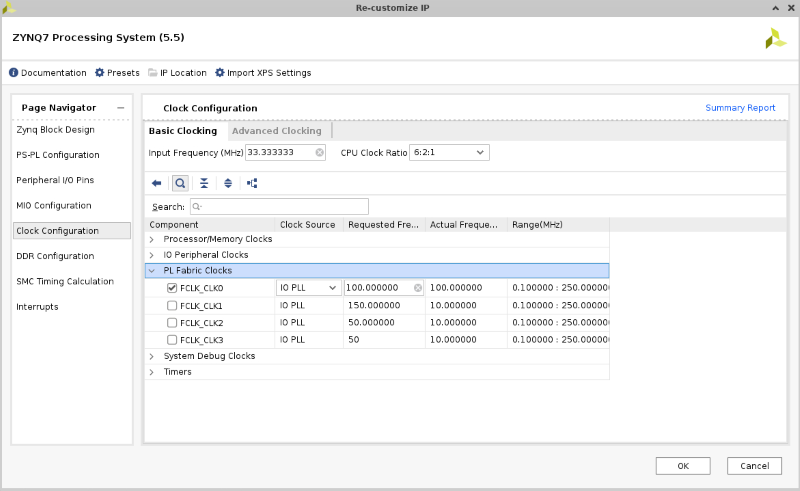

10. Click **DDR Configuration** and make sure **Enable DDR** is selected.

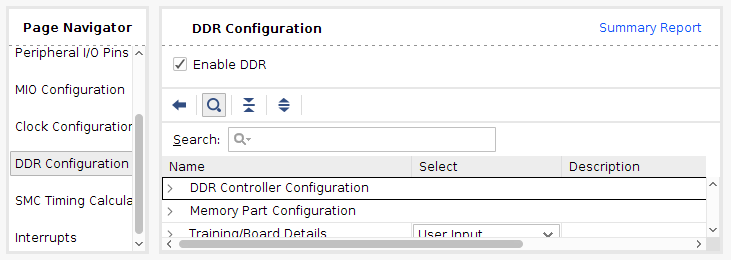

11. Finalize the **Zynq** (processing_system7_0) configuration by clicking the  button in the **Re-Customize IP** window.

> **Note:** For this laboratory, it is not necessary to configure **SMC Timing Calculation** or **Interrupts**.

Back in the block design canvas, you will notice the interfaces **M_AXI_GP0**, **M_AXI_GP0_ACLK**, **FCLK_CLK0**, and the **FCLK_RESET0_N** ports have been added to the **Zynq7 PS** block.

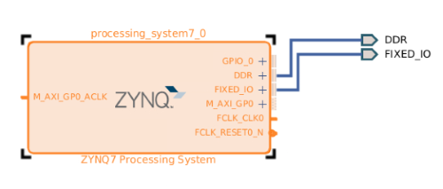

12. Connect **FCLK_CLK0** to **M_AXI_GP0_ACLK**.

The final design should look like the following image:

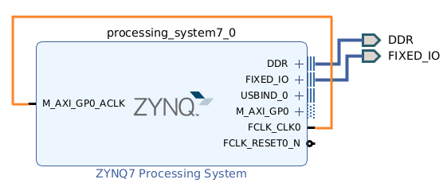

---

### 2.3. Synthesis, Implementation, and Hardware Generation

1. In the central panel, click the **Sources** tab. Expand **Design Sources** and you will see that the file *bd_helloWorld.bd* contains all configurations and settings of the block diagram.  
   Right-click **bd_helloWorld** and select **Generate Output Products**.

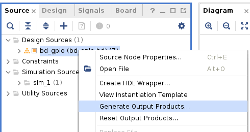

2. In the **Generate Output Products** window, under **Synthesis Options**, select **Global** [r1]. In the **Run Settings** [r2] section, click **Generate**. Click **OK** in the next window.

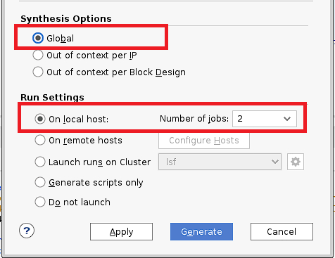

**Please wait until the process completes before continuing.**

3. Right-click **bd_helloWorld** and select **Create HDL Wrapper** to create the top-level VHDL/Verilog file from the block design.

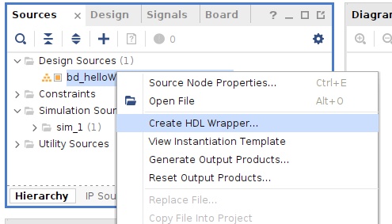

In the **Create HDL Wrapper** window, make sure to select **Let Vivado manage wrapper and auto-update**. This allows Vivado to automatically update the HDL wrapper when you modify the block design. Click **OK** to generate the wrapper.

You will see that **bd_helloWorld_wrapper** has been created and placed at the top of the design sources hierarchy.

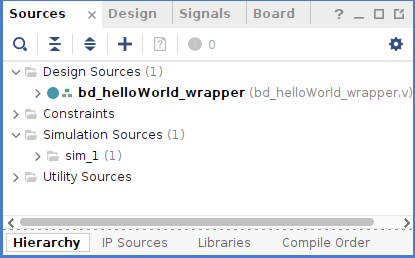

4. In the **Flow Navigator** panel under **SYNTHESIS**, click **Run Synthesis**.  
   This process converts the high-level design into a hardware description that can be implemented on the FPGA device.

5. In the **Flow Navigator**, click **Run Implementation**. In the pop-up window, click **OK**.  
   Implementation maps the synthesized design onto the physical FPGA resources. This may take some time depending on design complexity.

6. In the **Flow Navigator**, click **Generate Bitstream**. Keep the default settings and click **OK**.  
   After bitstream generation finishes, keep the *View Report* option checked. Hardware generation produces the files required to program the Zynq device.

7. Since an application is required to use the design, export the hardware to Vitis: **File → Export → Export Hardware**.  
   Because there is logic in the PL portion, the corresponding bitstream must be included in the export. Make sure to check **Include bitstream**, then click **Next**.

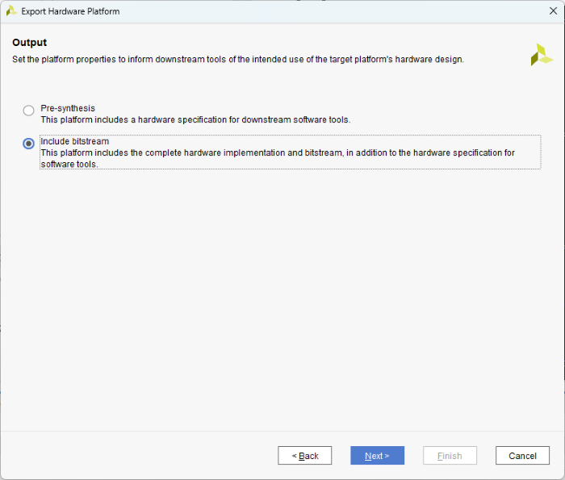

8. The hardware platform will be exported as an **XSA** file. Click **Finish** to complete the process.

At this point, your hardware design is ready and you can proceed to create an application project in Vitis, where the **C programming language** will run on the ARM processor.

---

## 3. Software

### 3.1. Launch Vitis IDE and Configure the Workspace

1. In Vivado, launch Vitis IDE by clicking **Tools → Launch Vitis IDE**.  
   The Vitis IDE launch dialog will appear and ask for the workspace directory. Click **Browse** to select it.  
   **As a recommendation, use the same directory as your Vivado project.**

### 3.2. Vitis Application Project

In this section, you will create the **C** application project and the code that uses the exported hardware design.

1. Select **File → New → Application Project**, or from the main window click .  
   Use the following information:

| Wizard Screen | System Property | Configuration |
|---------------|-----------------|--------------|
| Create a New Application Project |  |  |
| click **Next** |  |  |
| Platform | click **Create a new platform from hardware** |  |
|  | XSA File: | Browse: **bd_helloWorld_wrapper.xsa** \* |
| click **Next** |  |  |
| Application Project Details | Application project name | app_helloWorld |
| click **Next** |  |  |
| Domain | Name: | standalone_ps7_cortexa9_0 |
|  | Display Name: | standalone_ps7_cortexa9_0 |
|  | Operating System: | standalone |
|  | Processor: | ps7_cortexa9_0 |
|  | Architecture: | 32-bit |
| click **Next** |  |  |
| Templates | Available Templates: | Hello World |
| click **Finish** |  |  |

> **\*** 🔔 Remember that the **XSA** file was exported to your project folder:  
> **/home/student/Documents/cursoML/labs/Lab03**

After clicking **Finish**, the **New Application Project Wizard** closes and the created project opens in the Vitis main interface, which is divided into: Explorer, Assistant, Project Editor, and Console.  
In Explorer and Assistant, you will see two created items: the  application and the  platform project.

---

## 4. Testing

### 4.1. ZedBoard Development Board Setup

In this section, you will learn how to connect the ZedBoard to the PC and run the C application you created.

1. Connect a micro-USB cable between the Linux host machine and the **JTAG J17** connector on the ZedBoard (right side of the power connector). This connection will be used to program the PL.

2. Connect a micro-USB cable between the **USB UART (J14)** connector on the ZedBoard (left side of the power switch) and the Linux host machine. This connection will be used for serial data transfer between ZedBoard and the host.

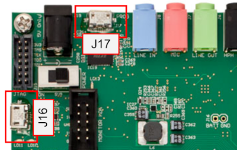

> **🔥 IMPORTANT:** Make sure that jumpers **JP7** to **JP11** are configured as shown in the image below for **JTAG** boot mode.

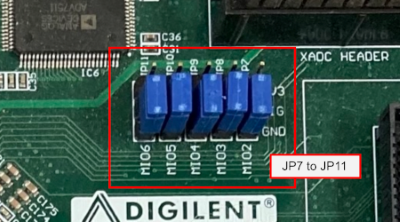

3. Verify the **J18** jumper setting in the bottom-right corner of the board. It must be set to **2.5V**, labeled as **2V5** on the board.

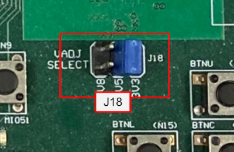

4. Connect the 12V AC/DC adapter to the ZedBoard power connector.

5. **Power on** the board using the ZedBoard power switch. Verify that the **power LED** (green LED) is ON.

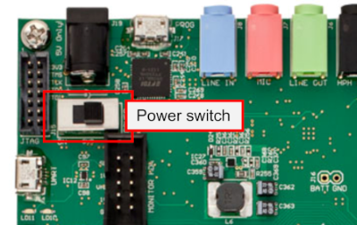

### 4.2. Serial Communication Software Setup

1. We will use **GTKTerm** to establish serial communication between the host machine and the ZedBoard.  
   To open GTKTerm, click **Applications → Accessories → Serial port terminal**.

{width=50%}

A window similar to the following will appear:

2. Click **Configuration → Port** and select **ttyACM0** with baud rate **115200**.

{width=50%}

### 4.3. Running the Application on the ZedBoard

1. In Vitis, right-click *app_helloWorld* and select  
   **Run → Run As → Launch on Hardware (Single application debug (GDB))**  
   to program the FPGA and run the compiled code on the PS.

2. A pop-up window will appear indicating that the FPGA is being programmed. When finished, the blue LED on the ZedBoard will turn on.

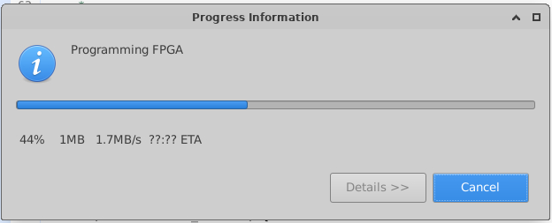

3. Go back to the **GTKTerm** window. If everything works correctly, you should see the application output in the serial console.
