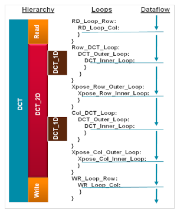

# High-Level Synthesis

### 1.1. Discrete Cosine Transform (DCT) Acceleration

For this laboratory, we will use material provided by **AMD/Xilinx**.

1. Clone the following repository:

   https://github.com/Xilinx/xup_high_level_synthesis_design_flow/tree/main

2. Navigate to the **source** folder. We will work with **lab3**, which implements the **Discrete Cosine Transform (DCT)**.  
   The following image shows the corresponding source code.

   

3. Create a project in **Vitis HLS**, importing the required source files.  
   Use the **ZedBoard** development board as the target platform.

4. Once the project is created, perform the following configuration steps:

   - In the menu, go to **Project → Project Settings** and click on **Synthesis**.

   <!-- - In the **Synthesis C/C++ Source files** section, locate the file `myproject.cpp` in the table, click on it, and then select **Edit CFLAGS**.  
     Replace the existing text with: **`-std=c++14`**. -->

   - Click **OK**.

5. For each of the following items, generate the corresponding **synthesis report** in order to evaluate metrics such as **resource utilization** and **latency**.  
   You may apply directives incrementally or analyze their individual impact on the generated hardware.

   - Improve performance using the **PIPELINE** directive.

   - Optimize fine-grain parallelism.

   - Apply the **DATAFLOW** directive.

   - Apply the **ARRAY PARTITION** directive.

   - If possible, propose a combined configuration of directives/optimizations.

   - Use the following clock periods: **12 ns, 10 ns, and 5 ns**.  
     Comment on the effects of this variation.

   - Finally, synthesize the design for the following part: **xc7a35tcsg325-1**.  
     What do you observe?

6. Simulate the project to verify its functional correctness.

### HLS Synthesis Results Summary (DCT Acceleration)

| Experiment | Directives Applied | Clock Period (ns) | Latency (cycles) | Latency (ns) | Initiation Interval (II) | LUTs | FFs | BRAMs | DSPs | Timing Met | Observations |
|-----------|--------------------|-------------------|------------------|--------------|--------------------------|------|-----|-------|------|------------|--------------|
| 1 | None (Baseline) | 12 | | | | | | | | | |
| 2 | PIPELINE | 12 | | | | | | | | | |
| 3 | Fine-grain parallelism | 12 | | | | | | | | | |
| 4 | DATAFLOW | 12 | | | | | | | | | |
| 5 | ARRAY PARTITION | 12 | | | | | | | | | |
| 6 | Combined directives | 12 | | | | | | | | | |
| 7 | Combined directives | 10 | | | | | | | | | |
| 8 | Combined directives | 5 | | | | | | | | | |
| 9 | Combined directives (xc7a35tcsg325-1) | 10 | | | | | | | | | |

**Guiding Questions:**
- Which directive provides the largest latency reduction?
- How does PIPELINE affect the initiation interval (II)?
- What is the trade-off between latency and resource utilization?
- At which clock period does timing start to fail?
- How does the change of FPGA part affect resource usage and performance?
