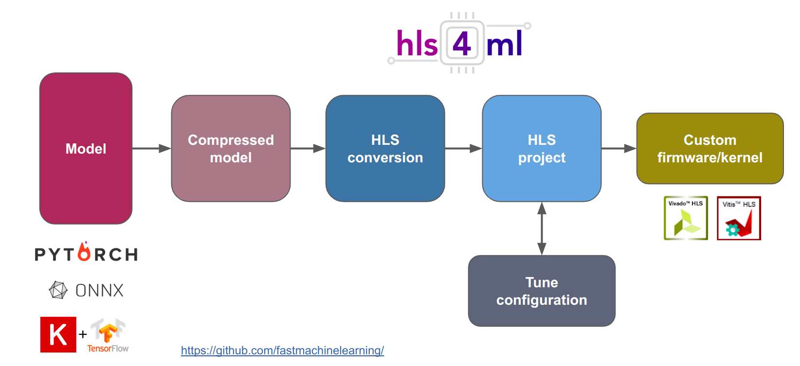
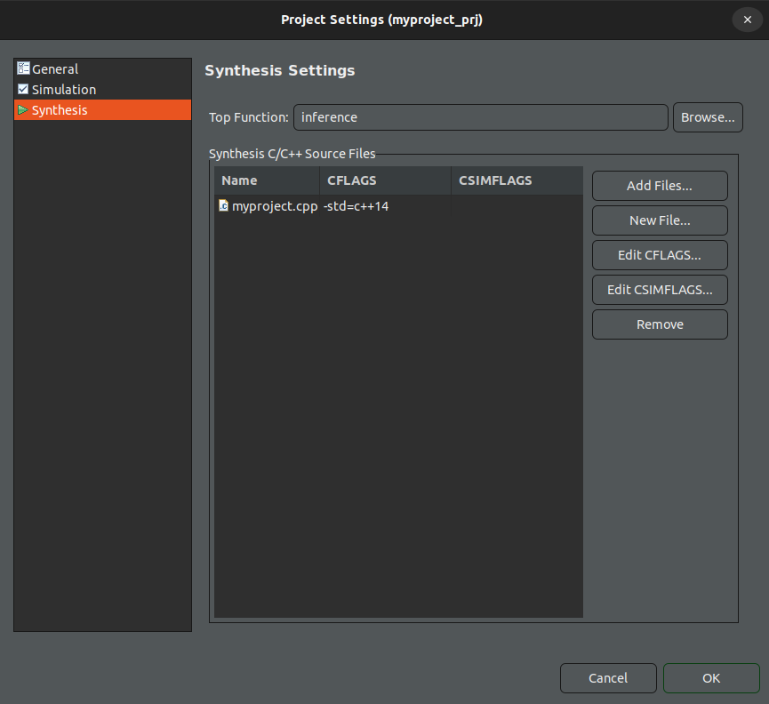
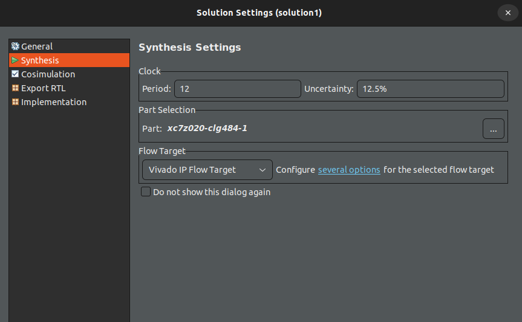
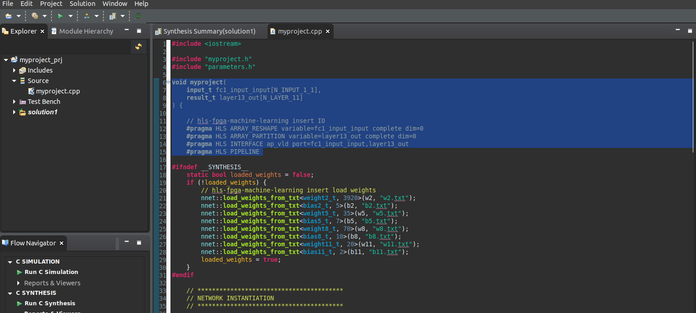
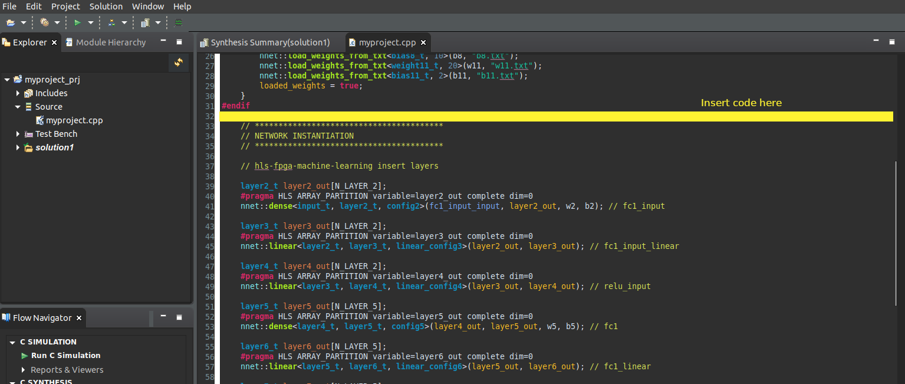
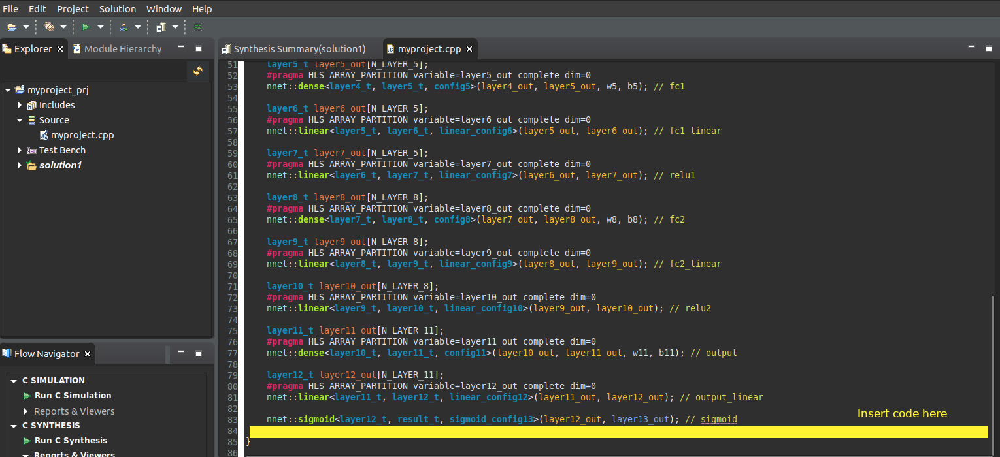
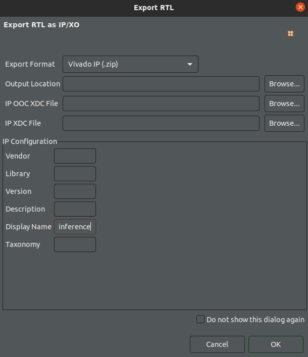

# ML and SoC-FPGA: Integration with a Hardware Design Synthesis Tool for ML

## 1. Introduction

Once the student model has been generated, the next step is to create the IP core in order to integrate it into the final hardware design. For this purpose, **hls4ml** is used as a bridge between the generated model and the HLS tool, as illustrated in the following figure.





<!--  -->

## 1.1. Objectives

* Learn how **hls4ml** can be used to translate the model into an HLS project.
* Explore the different options provided by the library.

# 2. Interaction with hls4ml

The main objective of this stage is to generate the IP core for the inference phase. The general steps are as follows:

1. Add the path to the Vitis HLS tool.
2. Load the pre-trained student model.
3. Define the configuration settings for the hls4ml library.
4. Convert the Keras model into an HLS project.
5. Compile and build the HLS project.
6. Export the IP core.


# 3. HLS Simulation, Synthesis, and Implementation

> In this part of the laboratory, the folder to be used was created in the previous lab using a Jupyter Notebook, and its path is **labs/lab05/hlsPrj/**.

The verification of the IP block functionality is performed using the Vitis HLS tool. To achieve this, several changes must be made to the generated **.c** source files in order to add the appropriate interfaces and test the IP block. Therefore, the following steps must be followed:

1. Open **Vitis HLS**. Then, open the project located in the folder  
   **lab05 → hlsPrj → myproject_prj**,  
   which was generated using the Jupyter Notebook file. In this way, the project created with hls4ml will be loaded into Vitis HLS.

2. Apply the following project configurations:

   - From the menu, go to **Project → Project Settings** and click on **Synthesis**.

   - In the **Synthesis settings** section, change the top function name to **inference**.

   > **Note**: The **top function** acts as the entry point of the design in Vitis HLS, connecting all input and output ports of the hardware module. It is responsible for setting the required input values and triggering the hardware module. Once the computation is complete, the _top function_ collects the output values and returns them to the software application.

   - In the **Synthesis C/C++ Source files** section, within the table, click on the **myproject.cpp** entry and then select **Edit CFLAGS**. Replace the text with: **`-std=c++14`**.

   - Click **OK**.

The configuration should look like the following image.

{width=70%}

3. Verify the following solution-related configurations:

   - From the menu, go to **Solution → Solution Settings** and click on **Synthesis**.
   - Set the **Clock** to **12**, with an uncertainty value of **12.5%**. The clock will be configured for a frequency of 80 MHz.
   - Select the corresponding target device: **xc7z020clg484-1**.
   - Leave the **Flow Target** set to **Vivado IP Flow Target**.
   - Click **OK**.

The configuration should look like the following image.


{width=70%}

4. In this step, several parts of the **myproject.cpp** file will be replaced within Vitis HLS. **The images below will help you identify the different parts of the code and where each change must be applied**.

   To create an HLS project using hls4ml with specific interface directives—especially when working with _AXI stream_ interfaces—it is necessary to modify the **top-level function** and specify the interface pragmas for the input and output ports. This requires using a specific dataflow structure depending on the HLS tool (in Vitis HLS, _hls::stream_ is used).

   In this project:

   - The input port will use an **AXI stream** interface.
   - For the control ports, the **ap_ctrl_hs** protocol will be implemented.
   - The output port will use the **ap_vld** interface.
   <!-- - For the control ports, the **s_axilite** protocol will be implemented. -->

   **ap_ctrl_hs**: Adds handshake-style control signals to the HLS block.
   - ap_start – Signal to start the operation.
   - ap_done – Signal indicating that the operation has finished.
   - ap_ready – Signal indicating that the block is ready to accept another ap_start.
   - ap_idle – Signal indicating that the block is idle.

   **ap_vld**: For each signal marked with _ap_vld_, Vitis HLS generates two signals:
   - data: the normal value of the port.
   - data_ap_vld: a boolean signal that becomes 1 when data is valid.

   Copy the following code:

    
    ```c
    void inference(
		hls::stream<axis_int_t>& input,
		int *result
    ) {

        //#pragma HLS INTERFACE mode=s_axilite port=return
        #pragma HLS INTERFACE mode=ap_ctrl_hs port=return
        #pragma HLS INTERFACE axis register both port=input
        #pragma HLS INTERFACE ap_vld port=result register
        // #pragma HLS PIPELINE

    ```
    
    Replacing the selected sections in the **myproject.cpp** file.


    
   

5. **myproject_test.cpp** File (Test Bench)

- Navigate to the folder  
  **/home/student/Documents/cursoML/git/ml-fpga-deployment-workflow/labs/lab07/src_hls**
- Copy the **myproject_test.cpp** file into the folder  
  **/home/student/Documents/cursoML/labs/lab05/hlsPrj/**
- This will **replace the previous file**.

6. **myproject.h** File

- Navigate to the folder  
  **/home/student/Documents/cursoML/git/ml-fpga-deployment-workflow/labs/lab07/src_hls**
- Copy the **myproject.h** file into the folder:  
  **/home/student/Documents/cursoML/labs/lab05/hlsPrj/myproject_prj/firmware**
- This will **replace the previous file**.


7. Open **myproject.cpp** in Vitis HLS

    In Vitis HLS, in the **Explorer** panel, open the file **Source → myproject.cpp**.

    🔴 Add the following code to **myproject.cpp**. This change will allow unpacking the input stream into a vector so that it can be used by the algorithm.

    ```c
        input_t fc1_input_input[N_INPUT_1_1];
        result_t layer13_out[N_LAYER_11];

        axis_int_t val;

        for(int h=0; h<N_INPUT_1_1; h++){

        #pragma HLS PIPELINE

                    // Read and cache value
                    val = input.read();
                    fc1_input_input[h] = val.data/255;

                }	
    ```

    The previous code must be placed after the **#endif** line (line 32) in the **myproject.cpp** file.

    

    🔴 The following code allows generating the output with the classification results. **This approach is only valid if you are using the model generated in the MNIST QAP demo. Otherwise, you must USE and ADAPT the second option.**


    ```c
            // Option 1
                if(layer12_out[1] < 0){
                    *result = 1;
                } else{
                    *result = 9;
                }
    ```

    ```c
            // Option 2
                if(layer13_out[0] > 0.5){

                    *result = 1;
                } else{
                    *result = 2;
                }
    ```
        
    Add the previous code before **`}`** (the last line) in the **myproject.cpp** file.

    

    Once the code modifications are complete, it is time to analyze how the IP block behaves when MNIST images are used as inputs.

8. Go to the **Flow Navigator** panel (in the lower-left corner). Under **C SIMULATION**, click **Run C Simulation**.

    


9. A *C Simulation Dialog* window will appear. Click **OK**. The simulation will start. Wait for the results.

    

10. After the simulation, in the **Flow Navigator** panel, under **C SYNTHESIS**, click **Run C Synthesis**. A pop-up window will appear with the settings for the active solution, showing the clock value, the FPGA device, and the flow target.
Leave these settings as they are and click the **OK** button. Wait for the synthesis report.
        


11. The final step is to generate the IP block. In the **Flow Navigator** panel (in the lower-left corner), under **IMPLEMENTATION**, click **Export RTL**. In the _Display Name_ field, enter the name **inference**. Click the **OK** button and wait until the export process is complete.

    

With the IP block generated, it is time to test the inference process on the SoC platform. **For this part, we will continue with Laboratory 8. There are three different options for hardware deployment. For the next step, we will focus on 01-Baremetal.**


