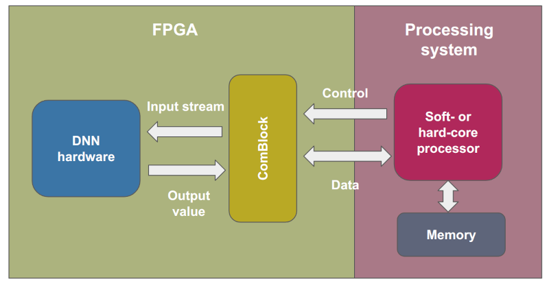
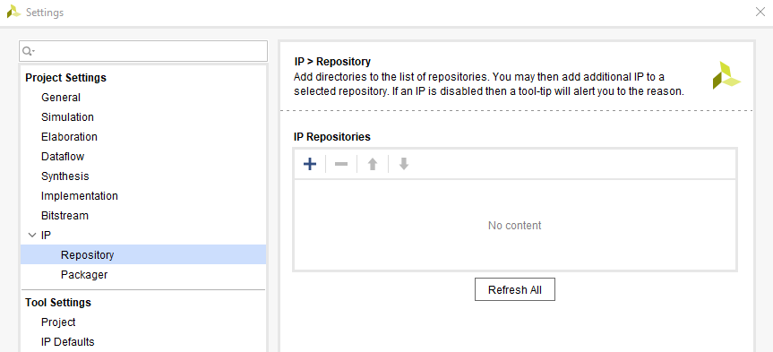
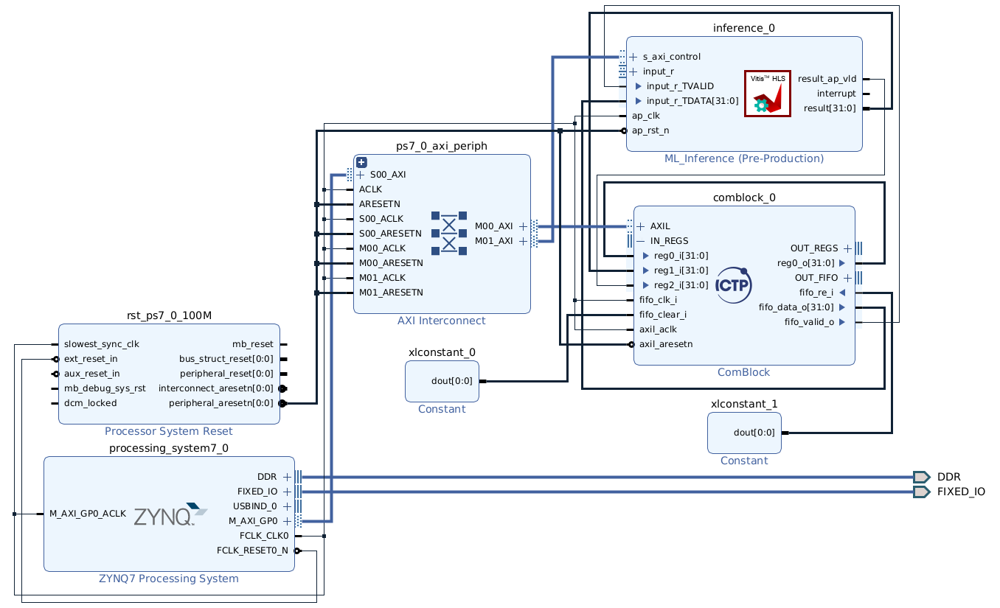

# ML y SoC-FPGA: Hardware de verificación


## 1. Outline

### 1.1. Introducción



<!-- {width=70%} -->

### 1.2. Objetivos

* Aprender a implementar modelos basados en ML en plataformas SoC-FPGA.
* Realizar la instanciación de un IP core previamente diseñado mediante una herramienta de síntesis de alto nivel.
* Integrar y verificar el diseño de hardware completo.


#### 1.3.2 Tool Command Language (TCL)

Tool Command Language (**TCL**) es un lenguaje de scripting utilizado, para interactuar con la línea de comandos de Vivado, entre otros. Permite la creación y manipulación de proyectos para FPGA, la configuración de restricciones de diseño, la síntesis e implementación de diseños, y otras tareas dentro del entorno de Vivado mediante la automatización basada en scripts. Este lenguaje de scripting es una herramienta valiosa para optimizar el proceso de diseño y desarrollo para FPGA, permitiendo compartir proyectos en entornos colaborativos.

La herramienta Vivado también genera un archivo conocido como "vivado.jou", que sirve como registro de los comandos TCL ejecutados durante la sesión. Este archivo de registro puede utilizarse como referencia para generar nuevos scripts en TCL.

La estructura general de los comandos TCL en Vivado es:

``` bash
command [optional_parameters] required_parameters
```

Para más información, puedes consultar [TCL reference manual](https://docs.xilinx.com/v/u/2012.2-English/ug835-vivado-tcl-commands)

# 2. Hardware

## 2.1. Proyecto de Vivado

1. Ejecutar _Vivado 2022.2_.

2.  En el menu **Quick Start**, click  en  para inicializar el asistente o click en **File → Project → New**.  **Create A New Vivado Project** dialog box in the **New Project** window. Click **Next**.Utilizar la información en la siguiente tabla para configurar las diferentes opciones del asistente:


| Opción del Asistente | Propiedad del Sistema | Configuración |
|---------------|-----------------|----------|
| Project Name | Project Name | Lab08-01 |
|  | Project location | `/home/student/Documents/cursoML2025/labs/lab08/01-Baremetal/` |
|  | Create Project Subdirectory | Check this option. |
| Click **Next** |  |  |  
| Project Type | Project Type | Select **RTL Project**. Keep  unchecked the option `do not specify sources at this time`.  | 
| Click **Next** |  |  | 
| Add Sources | Do nothing |  |  
| Click **Next** |  |  |  
| Add Constraints | Do Nothing |  |  
| Click **Next** |  |  |  
| Default Part | Specify | Select **Boards** |  
|  | Board | Select **ZedBoard Zynq Evaluation and Development Kit** |  
| Click **Next** |  |  |  
| New Project Summary | Project Summary | Review the project summary |  
| Click **Finish** |  |  | 

## 2.2. Respositorio IP


### 2.2.1. Agregar IP cores al repositorio

<!-- In this section you'll import the external IP cores into the project: **HLS-based ML inference** and *ComBlock**.

1. Click **Settings** in the Flow Navigator. Expand the **IP** option on the left pane of the Project Settings form.

2. Click on **Repository**, then click on the **Add** icon. -->
En esta sección, importarás el IP core externo al proyecto: **HLS-based ML inference**.

1. Hacer click en **Settings** en el Flow Navigator. Expandir la opción **IP** en el panel izquierdo de **Project Settings**.

2. Hacer click en **Repository**, luego en el ícono **Add**.



3. Ir al directorio `/home/student/Documents/cursoML2025/labs/lab05/hlsPrj/myproject_prj/solution1/impl`, seleccionarlo, y finalmente hacer click en el botón **Select** . Este directorio contiene el IP cores exportado en el laboratorio de hls4ml. 

4. Click en **OK** para finalizar el proceso en ambas ventanas. 


## 2.3. Block Design
Haremos uso de Tool Command Language (**TCL**) para construir un diseño a nivel de bloque a partir de los archivos fuente proporcionados y un script TCL. Notarás cómo Vivado comenzará a construir el sistema desde cero hasta obtener un diseño sintetizable. Esta es una forma limpia de trabajar con herramientas de control de versiones (como Git) en entornos colaborativos.

1. Este proyecto utiliza un diseño de bloque pre-generado (block design, BD). Para volver a generarlo, en el panel inferior de Vivado, haz clic en la pestaña **Tcl Console**.

2. Para saber en qué directorio estás trabajando, escribe en la línea de comandos TCL `pwd`. Esto mostrará el directorio de trabajo actual.


``` bash
pwd
```

3. Cambia tu directorio de trabajo al directorio **bd**. Para ello, usa el comando tcl **cd** para cambiar el directorio. Escribe:

``` bash
cd labs/lab08/bd/PYNQZ1/
```


4. Un archivo TCL puede ser cargado desde Vivado. Para recrear el diseño de bloque, necesitarás un archivo de comandos tcl, que en este caso es **bd_inference.tcl**. Para recrear el diseño de bloque, escribe en la consola Tcl:

``` bash
source ./ML-PYNQ.tcl
```

>**Nota:** Cuando activas la ejecución de un script Tcl en Vivado, aparecerá una barra de progreso y todas las operaciones dentro de Vivado se detendrán hasta que el script termine de ejecutarse.

Como resultado del proceso, obtendrás un diseño de bloque con los siguientes componentes principales: el sistema de procesamiento Zynq7, ComBlock, y el bloque de inferencia basada en HLS. El diseño de bloque final debería verse como sigue:




5. Click en **Regenerate Layout** y observa más de cerca el diseño, las conexiones y los registros de configuración.

6. **Generar output products** del diseño de bloque **bd_inference.bd**


7. **Crear HDL wrapper** del diseño de bloque (_bd_inference.bd_) y configurarlo como **Top**.


8. En el panel  **Flow Navigator**, haz click en **Generate Bitstream** y haz clic en **Yes** si se te solicita guardar el **Block Diagram**. También haz clic en Sí cuando se te pida lanzar la síntesis e implementación. Haz clic en **Cancel** cuando se te pida abrir el **Implemented Design**.

9. Dado que necesitas crear una aplicación para usar el diseño, debes exportar el hardware generado al entorno Vitis. Haz click en: **File -> Export -> Export Hardware**. Dado que hay algo de lógica en la parte PL del Zynq, el bitstream respectivo debe incluirse en la tarea de exportación. Por lo tanto, asegúrate de marcar la casilla **Include bitstream**. Luego haz click en **Next**.

En este punto, tu diseño de hardware y configuración están listos. Puedes proceder a acceder a la placa de desarrollo PYNQ y trabajar desde el Jupyter Notebook en el framework PYNQ. Para ello, se provee el archivo **08-hwIntegrationPYNQ.ipynb**.

Intrucciones de acceso a la placa PYNQ-Z1: https://pynq.readthedocs.io/en/v2.2.1/getting_started/pynq_z1_setup.html


