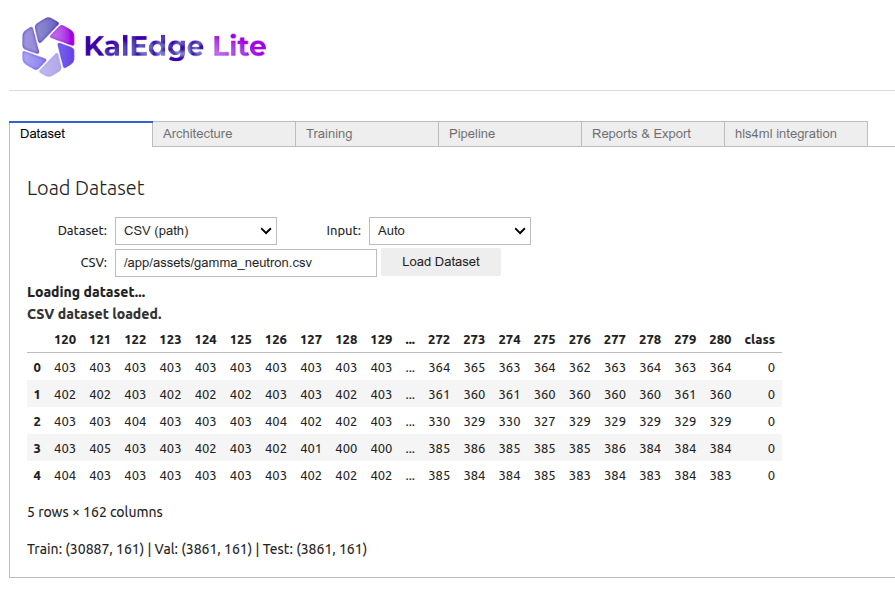
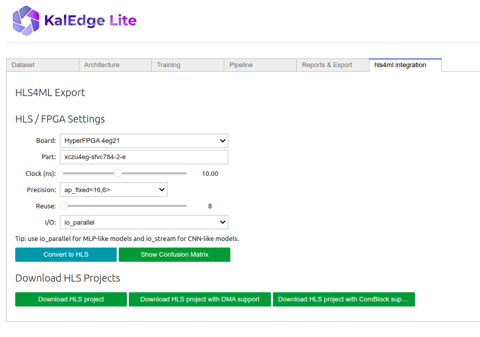

# End-to-End ML to FPGA Deployment with KalEdge-Lite


## Objective

By completing this lab, you will be able to:

- Use the **KalEdge-Lite graphical workflow** to load the dataset and configure the input format.
- Select, configure, and train different neural network architectures (Baseline, Student, QKeras) directly from the application.
- Compare model variants using the metrics and reports generated by the platform.
- Generate an FPGA-oriented implementation through the **hls4ml integration** within KalEdge-Lite.
- Export an HLS project ready for hardware synthesis and deployment.

The workflow follows a complete **end-to-end pipeline**, from data ingestion to FPGA deployment. 

---

## Pre-requisites

Before starting, make sure you have:

- Access to **KalEdge-Lite**
- A valid HyperFPGA instance
- Basic understanding of:
  - Neural networks
  - Model training
  - FPGA-based acceleration


---

### 1. Launch the Application

Open **KalEdge-Lite** using the following link:


---

### 2. Load the Dataset

1. Open the **Dataset** panel.
2. From the dropdown menu, select **CSV (path)**.
3. Enter the following path:

    `/app/assets/gamma_neutron.csv'`


This dataset corresponds to the **gamma/neutron discrimination system**.

4. Leave the **Input** parameter set to **Auto**.

Once loaded, you should see a window similar to the one shown below.



---

### 3. Define the Model Architecture

Go to the **Architecture** tab and select one of the predefined models.

For each model:

1. Click **Save**
2. Then click **Load into Pipeline**

Available options:

- **Baseline model**
- **Student model**
- **QKeras model**

---

### 4. Configure Training

In the **Training** window:

- Configure the training parameters if desired.
- You can train each model independently.
- For this tutorial, **leave all parameters as default**.

---

### 5. Configure the Pipeline

1. Go to the **Pipeline** tab.
2. In **Score Priorities**, select: **FPGA**.


---

### 6. Pipeline Builder

In the **Pipeline Builder** section:

- Leave all options at their default values.

---

### 7. Run the Pipeline

Click **Run Pipeline** and wait until the process completes.

---

### 8. Results

Once finished:

- A message **“Report generated”** will appear.
- Navigate to the **Reports & Export** tab. In this section, you can inspect the generated report. 

---

### 9. HLS Integration

Click on the **HLS4ML Integration** tab.

#### HLS / FPGA Settings

Configure the following:

1. **Target board**
- `HyperFPGA 4eg21`
- `HyperFPGA 3be11`

    >Note: Must match the FPGA instance assigned in HyperFPGA.

2. **Clock period**: 10ns

3. **Precision**: ap_fixed<16,6>

4.  **Reuse factor**: 8

5. **I/O type**: io_parallel



---

### 11. Generate HLS Project

Click:

➡ **Convert to HLS**

Wait until the conversion process finishes.

---

### 12. Visualization

Click **Show Confusion Matrix** to visualize the classification performance.

---

### 13. Download

Finally:

- Download the **HLS project with ComBlock support**
- The project is now ready for FPGA synthesis and deployment


## Automate IP core generation and hardware creation 

In this step, we will use a set of automated scripts to generate the IP core and the corresponding `.xsa` file.  
The generated `.xsa` file will later be uploaded to the HyperFPGA platform for hardware deployment.

> **Important – Board Files Setup**
>
> Before running the Vivado TCL script, make sure that the **board files are properly installed**.
>
> The board definition files must be copied into the corresponding Vivado installation directory.  These files are provided in the following repository:
>
> https://gitlab.com/ictp-mlab/hyperfpga-bsp/
>
> Follow the instructions in the repository to install the board files before continuing.
>
> **If the board files are not installed, Vivado will not recognize the target FPGA board and the TCL script will fail.**


1. Navigate to the `scripts/automate` directory within the cloned repository.
2. Open the `hw_tcl.ipynb` notebook.
3. Execute all cells to run the automated hardware generation flow.
4. After completion, return to this document to proceed with the next stage of the workflow.
5. Clone the ComBlock repository from https://gitlab.com/ictp-mlab/core-comblock.
6. Once cloned, copy the entire repository folder into the following directory:
 `ml-fpga-deployment-workflow/scripts/automate/ip`. 
This step makes the ComBlock IP available for integration during the FPGA build process.

The final hardware is presented in the following Figure. 


## Interaction with the HyperFPGA

1. Access to the HyperFPGA: https://hyperfpga.sti.ictp.it/.
2. In the workspace area, upload the **`.xsa` file** located in: `scripts/prj`. 
3. Upload the **testing dataset** located at:
 `ml-fpga-deployment-workflow/labs/labKalEdge-Integration/src`.
4. Finally, upload the corresponding **Jupyter Notebook** found in: `ml-fpga-deployment-workflow/labs/labKalEdge-Integration/src`.

>Note: These files are required to run the validation and deployment steps on the FPGA platform.


### Required Files for Deployment

| Item | Path | Purpose |
|------|------|---------|
| `.xsa` file | `scripts/prj` | Contains the synthesized hardware design exported from Vivado. |
| Test dataset | `ml-fpga-deployment-workflow/labs/labKalEdge-Integration/src` | Used for validating the deployed model on FPGA. |
| Jupyter Notebook | `ml-fpga-deployment-workflow/labs/labKalEdge-Integration/src` | Executes inference and evaluates performance metrics. |


> Note 1: 
> The provided `.xsa` files allow users to complete the laboratory even if Vivado is not installed locally.  
> This enables a lightweight workflow focused on deployment and evaluation.

> Note 2:
> If you are unable to generate the `.xsa` file locally (for example, due to the absence of Vivado), a pre-generated version is provided.
>  
> The file can be found in:
>
> ```
> ml-fpga-deployment-workflow/labs/labKalEdge-Integration
> ```
>
> This allows you to continue with the laboratory without running the HLS or Vivado flow.


5. Continue with the lab in the HyperPFGA.