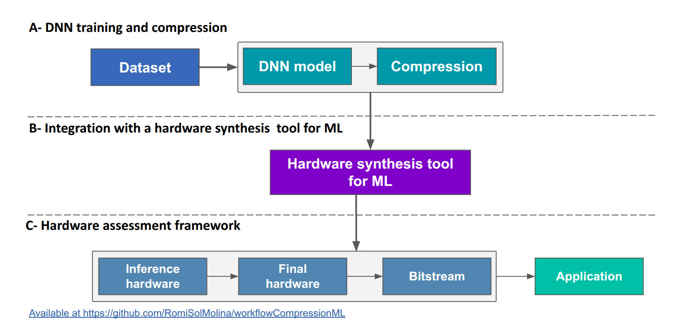
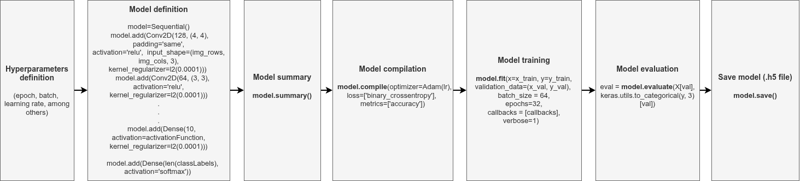
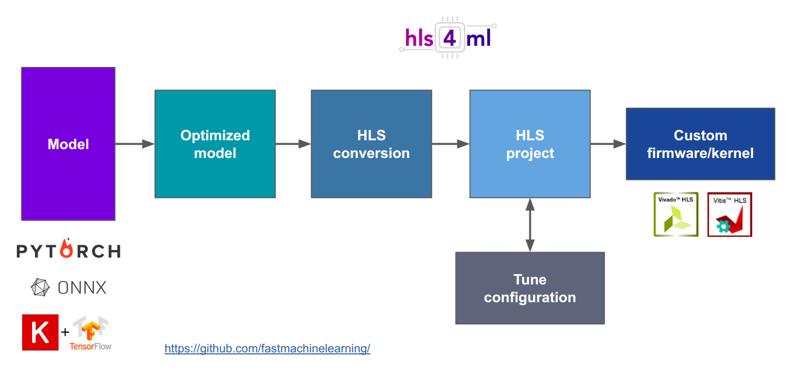

# Laboratory overview

## Common Components of the DNN-to-FPGA Workflow 

This module focuses on the common components and foundational steps that appear across all DNN-to-FPGA implementations, regardless of the neural network architecture being deployed (e.g., MLP, CNN, RNN). While later modules will address architecture-specific considerations, this module establishes the shared workflow elements that serve as the backbone of the entire design process.

We begin by reviewing the general procedures for training and compressing neural network models to obtain representations suitable for hardware translation. The module then introduces the configuration and use of hls4ml, the tool responsible for converting high-level machine learning models into synthesizable hardware descriptions compatible with Xilinx’s Vitis HLS environment. Additionally, we cover the essential steps for generating reusable IP cores, integrating them into a standard Vivado block design, and enabling communication via AXI DMA within the PYNQ platform.

By consolidating these common aspects into a single module, students gain a coherent understanding of the core workflow stages that remain consistent across different case studies. This foundation not only streamlines learning but also emphasizes the modularity and reusability of the hardware design process for accelerating diverse neural network models on FPGA platforms.

### 1. Training
Neural networks are composed of parameters and hyperparameters. Parameters are learned during training, such as the weights of the filters in a convolutional neural network (CNN). In contrast, hyperparameters are defined by the user before training begins. Hyperparameters specify both the architecture, such as the number of layers, the number of filters per layer, and the dimensions of the filters, as well as the learning process, including the learning rate, batch size, number of epochs, and early stopping criteria.

The main steps involved in the training and testing process are illustrated in the following image, along with their corresponding functions.

The first two steps focus on defining the hyperparameters and setting up the machine learning architecture. Subsequently, a model summary helps review how the model was built.

Once the model is created, parameters such as the optimizer, loss function, and metrics are configured using the model.compile() function.

Finally, training is carried out using the model.fit() function, where the dataset, batch size, number of epochs, and callbacks, among other settings, are specified.

#### Model Compilation

In this step, we configure the model by specifying the loss function, optimizer, and evaluation metrics.  This setup is essential before starting the training process.

- **loss**: A metric that measures how far the model’s predictions are from the actual values.

- **sparse_categorical_crossentropy**: used when labels are provided as integers.

- **categorical_crossentropy**: used when labels are one-hot encoded.

- **optimizer**: The algorithm that adjusts the neural network's weights to minimize the loss function.

    - SGD (Stochastic Gradient Descent)

    - Adam (Adaptive Moment Estimation that balances speed and stability)

- **learning rate**: A hyperparameter that controls how large the updates to the model’s weights are in each iteration.

- **metrics**: Additional values monitored during training to evaluate model performance. For example, accuracy is commonly used in classification tasks.

#### Model Training

During training, the model learns to adjust its internal parameters (weights) to minimize the loss function and improve prediction accuracy.

- **x_train_norm:** Normalized dataset obtained by applying a transformation to `x_train`.

- **y_train:** Labels (or expected values) corresponding to the training data.

- **batch:** Number of samples processed before the model's weights are updated.

- **epochs:** Number of times the model will iterate over the entire training dataset.

- **validation_split:** Percentage of the training data (`x_train`, `y_train`) set aside for validation.

### 2. Compression
As ML models become more complex, deploying them on resource-constrained devices such as FPGAs requires strategies to reduce their size and computational demands. This section introduces the model compression methods that can be applied to any DNN to reduce computational cost and memory footprint before hardware deployment.

**Quantization:**
Converts floating-point weights and activations into lower-precision formats (e.g., 8-bit or fixed-point). This reduces resource usage and increases inference speed, with a possible trade-off in numerical accuracy.

**Pruning:**
Removes redundant weights or neurons from the network. Structured or unstructured pruning can significantly reduce model size and computational complexity, though excessive pruning may degrade accuracy.

**Knowledge Distillation:**
Trains a smaller student model to mimic the behavior of a larger, high-accuracy teacher model. The student learns from the softened outputs of the teacher rather than from labels alone, often achieving competitive accuracy with far fewer parameters. This technique is especially useful when targeting FPGA implementations that require compact, hardware-friendly architectures.

Together, these compression techniques enable the generation of efficient models that maintain acceptable performance while reducing the hardware resources required, making them well-suited for FPGA acceleration.

### 3. Performance metrics

#### ROC Curve

The **Receiver Operating Characteristic (ROC) curve** is a graphical representation used to evaluate the performance of a binary classification model. It plots the **True Positive Rate (TPR)** against the **False Positive Rate (FPR)** at various classification thresholds.

A model with good predictive ability will have a curve that approaches the top-left corner, indicating high sensitivity and low false positive rate. The **Area Under the Curve (AUC)** provides a single scalar value summarizing the overall performance of the classifier.

> **Note:** The ROC curve is primarily used for binary classification. For multiclass problems, it can be computed using a one-vs-rest (OvR) strategy.

#### Confusion Matrix

The **confusion matrix** is a useful tool for analyzing the performance of a classification model in terms of accuracy. It presents the prediction results in a matrix format, comparing actual values (true labels) with predicted values.

In a binary classification problem, the confusion matrix is a 2x2 grid with the following components:

- **True Positives (TP):** Number of instances where the model correctly predicted the positive class.

- **True Negatives (TN):** Number of instances where the model correctly predicted the negative class.

- **False Positives (FP):** Number of instances where the model incorrectly predicted the positive class.

- **False Negatives (FN):** Number of instances where the model incorrectly predicted the negative class.

### 4. hls4ml workflow and IP core generation

Once the *hls4ml* project has been synthesized and the hardware metrics have been reviewed (latency, throughput, LUT/FF/DSP/BRAM utilization), the next step is to enable FPGA integration.

To achieve this, an AXI-based wrapper must be added around the generated HLS model, typically including AXI4-Stream interfaces for data movement and AXI-Lite for control.

This wrapper allows the design to be driven by a DMA engine or other AXI infrastructure in the FPGA system, enabling high-performance inference from the processing system or external data sources.

The *build_accel.tcl* script defines the complete HLS build process: itcreates a clean Vitis HLS project, adds the **hls4ml** sources plus the AXI/DMA wrapper, configures the FPGA part, sets the clock, and triggers synthesis. Also,  it generates a fully packaged IP core that can be directly imported into Vivado.

### Template Vivado Project - DMA

### Template Vivado Project - ComBlock

### 5. PYNQ-based Evaluation Template

A unified evaluation workflow is used throughout the projects to validate the hardware accelerators generated for the MLP, CNN, and RNN case studies. Although each model produces a different IP core, the interaction with the FPGA platform follows the same structure, implemented through a reusable PYNQ template provided in the practical sessions.

Once the bitstream and hardware design are loaded as an overlay, the accelerator becomes accessible through Python, along with the AXI DMA engine responsible for streaming input and output tensors between the processing system (PS) and the programmable logic (PL). The dataset used for verification is then prepared in the appropriate numerical format, such as fixed-point representations for quantized models, and transferred to the accelerator. After computation is triggered, the results are retrieved from the DMA receive channel and compared with software-generated references to assess correctness.

This template also supports the evaluation of key performance metrics, allowing consistent benchmarking across all network architectures. By abstracting common tasks—overlay loading, DMA setup, IP interaction, dataset handling, and metric collection, the PYNQ workflow provides a unified and reusable foundation for all experiments. Students can therefore focus on the behavior and performance of each accelerator, without re-implementing platform-level routines. The detailed step-by-step implementation and code examples are provided separately in the repository.
